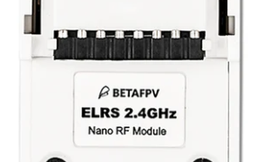
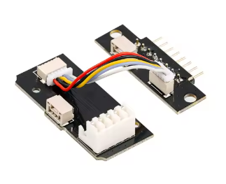
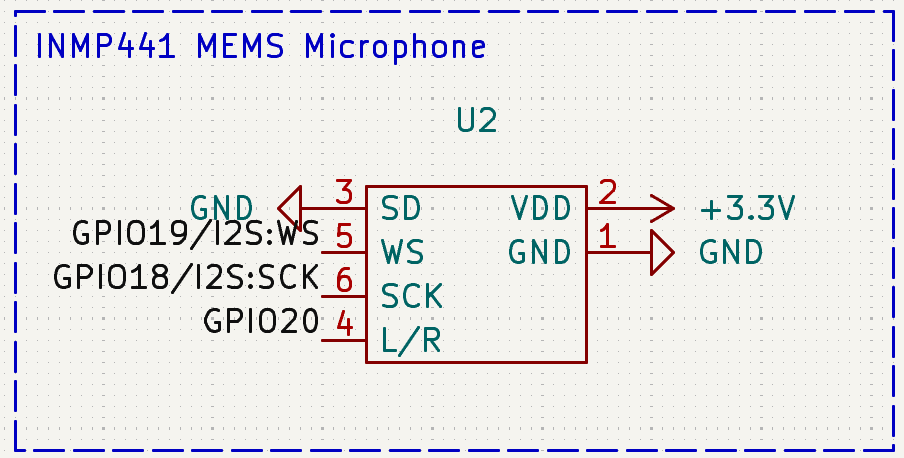
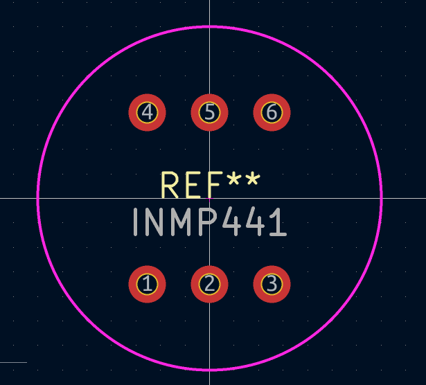
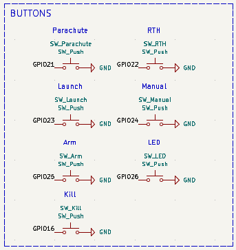

# June 25th: Selecting Parts And Starting PCB

## Choosing the flight controller

The goal for my project is to create an autonomous drone that can take an address and go to its coordinates, without any human intervention. To do this, I need a strong flight computer and a companion board
capable of taking sensor data and turning it into commands to send over MavLink to the flight computer so it can avoid obstacles. I've never built a drone before, so I started searching online and found a few videos
where people used flight stacks, which combined both the fc (flight controller) and esc (electronic speed controller) into a small, stackable package. I decided to search for cheap flight stacks, as it would help
reduce wiring and make the drone's overall footprint smaller. Here are a few fc stacks I found after about 90 minutes of searching:

| Stack | SpeedyBee F405 V4 BLS 55A 30×30 FC&ESC Stack                                                                                                                                                                                                      | MAMBA MK4 F722 APP 55A ESC                                                                        | MAMBA MK4 F722 MINI F40 40A ESC                                            |
|-------|---------------------------------------------------------------------------------------------------------------------------------------------------------------------------------------------------------------------------------------------------|---------------------------------------------------------------------------------------------------|----------------------------------------------------------------------------|
| Price | $84.99                                                                                                                                                                                                                                            | $98.99                                                                                            | $85.99                                                                     |
| Link  | https://www.myfpvstore.com/fpv-electronics/speedybee-f405-v4-bls-55a-30x30-fc-esc-stack-pick-your-esc-or-flight-controller-or-stack/?attribute_config=Flight+Controller&srsltid=AfmBOorgCc-LYhP6BXKjNDUj5Wo4KQOgMTNqw8LecNfK0Dei91qbN8SLbX0&gQT=1 | https://www.diatone.us/collections/mamba-stack/products/mb-mk4-f722-app-fc?variant=39828008337495 | https://www.diatone.us/products/mb-mk4-f722-mini-fc?variant=39800999444567 |

These stacks are all pretty expensive, but for now I've decided to go with the SpeedyBee F405 stack, since it comes with a 55A esc. I will need a strong (high amperage) esc to ensure that I can power a large 
drone with a possibly heavy payload. Choosing a F405 may be problematic when trying to use obstacle avoidance, since it is lower specced than F7 variants like the MAMBA F722, but the companion board should be able to
compute for it.

## Choosing a companion board

Choosing a companion board was pretty straightforward since I already have an RPi 5 laying around at home with no use, so I decided that it would be a good choice. I also have a 64MP camera from ArduCam which I can use
for visual obstacle avoidance. Paired with [this](https://www.amazon.com/MakerFocus-Single-Point-Ranging-Pixhawk-Compatible/dp/B075V5TZRY/) micro lidar for $42.99, the RPi should be able to make good observations about
its environment and react accordingly. After browsing the ArduPilot website (which I plan to use for firmware on the fc), I saw that RPi boards can easily be wired to the fc and can communicate with them using the MavLink
protocol, making the whole setup easier.

## Creating The Transmitter (Controller)

As I started to choose other parts for the drone, such as motors, a vtx, and cameras, I realized that the total price was starting to get high, while I had no estimate of the cost of the PCB. I decided to start making
the PCB first so I could get a good estimate for its cost.

I started with the main MCU, which I chose to be an RPi Zero 2 W, since I have one laying around as well. After searching online, I found that most drones use a protocol called ELRS to communicate. I found the cheapest
(while still reliable) ELRS TX from BetaFPV, their [Nano TX](https://betafpv.com/products/elrs-nano-tx-module?variant=39416993382534). Initially, I spent some time trying to figure out what the connector on the bottom
was, since it seemed to be something that commercial controllers used to connect to the ELRS module. 

I was unable to find the connector. However, while looking for the connector on BetaFPV datasheets, I found [this](https://www.aliexpress.us/item/3256805485078820.html?spm=a2g0o.productlist.main.2.45a074d4xgLRqQ&algo_pvid=9dc8a4cc-f35b-4f58-bf59-19bcd15fab2d&algo_exp_id=9dc8a4cc-f35b-4f58-bf59-19bcd15fab2d-1&pdp_ext_f=%7B%22order%22%3A%2230%22%2C%22eval%22%3A%221%22%7D&pdp_npi=4%40dis%21USD%216.19%210.99%21%21%216.19%210.99%21%402101e7f617508718492568964e2212%2112000033963418090%21sea%21US%216238534509%21ABX&curPageLogUid=mIJLSDhtRmo2&utparam-url=scene%3Asearch%7Cquery_from%3A) adapter to connect Nano size ELRS TX modules to Micro size modules. In this listing, there were two variants, one with a case, and one with the PCB only. I decided that I would get the PCB only version and cut the wires that came from the Micro connector, allowing me to solder them to my custom PCB. The connection was simple enough, with GND, 5v, and a CSRF Serial Port, which allows the RPi to send data to the ELRS module.

||
|---------------------------|
|I plan to cut the wire connecting the two boards together and solder them to my PCB|

Next I created a symbol and footprint for a MEMS microphone module (INMP441), added it into my schematic, and wired it up. Creating the footprint was a bit difficult since I couldn't find a single datasheet anywhere for the microphone, so I had no idea of how far the headers are from the edges of its PCB. I was able to find a very lacking diagram that had a top-down view of the microphone and gave me the diameter of the PCB. using this measurement, I estimated the headers to be about 3.5mm from the edge of the PCB.

| ||
|----------------------------|---------------------------|
| Symbol and footprint for the microphone                |

Next I modeled a footprint for a JH16 joystick and wired two of those to an ADC since the Pi Zero doesn't have analog ports. For the ADC, I used a MCP3008 and wired it to GPIO 9, 10, and 11. I also added an OLED for some status information and added a lot of buttons for various purposes.

Next, I searched for a while on AliExpress to try and find a VRX module. This was hard to find as most modules only exist in commercial headsets or FPV displays. I wanted to mount a display directly to the rc controller. I was able to find [this](https://www.aliexpress.us/item/3256803424747907.html?spm=a2g0o.productlist.main.1.10964bd5jEUqfr&algo_pvid=466401c5-08b4-45ab-8d8b-04525a704688&algo_exp_id=466401c5-08b4-45ab-8d8b-04525a704688-0&pdp_ext_f=%7B%22order%22%3A%2220%22%2C%22eval%22%3A%221%22%7D&pdp_npi=4%40dis%21USD%2130.68%2116.68%21%21%2130.68%2116.68%21%40210337bc17508875091944994e60ac%2112000036739939395%21sea%21US%216238534509%21ABX&curPageLogUid=Nlgo7jIuctVy&utparam-url=scene%3Asearch%7Cquery_from%3A) reciever for $16.68. However, the finding a display for this reciever was just as hard. I initially looked for just an AV display module, but they were too expensive, averaging around $40. I found a reddit post where someone was trying to make something similar and found [this](https://oscarliang.com/diy-fpv-display-fatshark-module/) article where someone created a DIY FPV reciever using a car backup display. I searched AliExpress and quickly found [this](https://www.aliexpress.us/item/3256807008143866.html?spm=a2g0o.productlist.main.9.bb35HudVHudVKL&algo_pvid=0366aa92-9c5e-4f2f-99df-266da67ee4fd&algo_exp_id=0366aa92-9c5e-4f2f-99df-266da67ee4fd-8&pdp_ext_f=%7B%22order%22%3A%2240%22%2C%22eval%22%3A%221%22%7D&pdp_npi=4%40dis%21USD%2118.44%2118.07%21%21%21131.45%21128.82%21%402103010e17509028489278830e7b2f%2112000039762349015%21sea%21US%216238534509%21ABX&curPageLogUid=kccZc2bw8ewx&utparam-url=scene%3Asearch%7Cquery_from%3A&_gl=1*ix8opv*_gcl_au*Nzc4NzI1NjUyLjE3NDkxNDE5NTk.*_ga*NjY3NDI4MDUyMTYzMDA1LjE3NDM5NTQ4MDYxMzU.*_ga_VED1YSGNC7*czE3NTA5MDI4MDIkbzE2JGcxJHQxNzUwOTAyOTMwJGoxNCRsMCRoMA..) display for $18.07, which I plan to take apart and place in my 3D printed controller. Next I need to work on swapping the battery, as I had planned to power everything using 2 AA batteries, but the FPV reciever and display both use 12V, placing too much strain on an MT3608 module to step up the voltage. I would risk frying the step ups or ruining the batteries.

## Total Time Spent: 5 Hours

# June 27th: Research And Work On PCB

Today I spent much of my time learning about 18650s and how they work. I realized while making my PCB last time that using two AA batteries to supply both 5v and 12v to multiple devices wouldn't be enough. It took me a while, but after watching some videos, I learned how 18650s worked and the difference between wiring them in series or parallel. I decided it would be best to wire 3 18650s in series, since this would allow me to reach a nominal voltage of 11.1v, which could sufficiently power both 5v and 12v. However, I had no idea how to charge these batteries. I found [this](https://www.amazon.com/DWEII-Lithium-Battery-Multi-Cell-Step-Up/dp/B0C5GQYNL1/ref=sr_1_2?crid=3IOIZJPV1VHGG&dib=eyJ2IjoiMSJ9.zJJT-NSESJb9uYCtYXwqm4AibWW5pa3RBg2ggv3_91c1r5xgyshFaufj2tMjzo9U7JX3eSUNGJ2VJsGXdsSMzCD7aH85JIm1NwBLmaiGlnCOu7-dAaOD7x-n-heN4M1gY92LldzCoCn51vt0HFZR_IqonAnLM_aDDwGehMet3ws3HMx0Awc6irXKOVm2ZqnuTJ-zEan6asgf4C3Mdrt83f9Fl4ZFcCIGHRYyLp5jUgTgQRPBOBkQ9EfrJvgkPx2Xz8bV841Tc5rDdYHks3zLSSQbpQQuV1PP0WfPFtGaxH4.VeGpiHhHhBNn3TEgRZ-iam5B3_aMkPxrGzB16C1MlPI&dib_tag=se&keywords=3s%2Blion&qid=1750953922&sprefix=3s%2Blion%2B%2Caps%2C149&sr=8-2&th=1) module which had USB C, but I wasn't sure how to get the battery power out of it. From my understanding, this module only charges the batteries and does not have load balancing, meaning that I would constantly need to unplug the batteries from the controller and plug them into the charger. I was looking for something else, a way to charge the batteries without having to unplug them from the main circuit. I spent the next hour looking for something that could do this, as I found TP4056 modules which had dedicated OUT+ and OUT- pins

